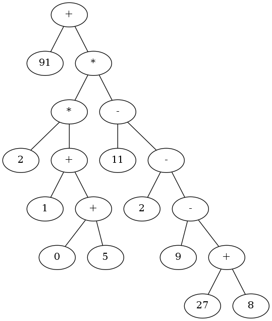

SimpleCalc
========

A compiling (or directly executing) calculator using [Polish Notation](https://en.wikipedia.org/wiki/Polish_notation) as input.

A number of different source output transformers are provided (C, Java, Python, LLVM, WASM).

Build using `./build.sh` or `.\build.bat` then follow usage instructions.

    Usage: ./build/calc [OPTIONS] "PROGRAM"

    SimpleCalc Simple Tokenizer, Parser, Traverser, Transformer, Generator,
    Linker, Executor. If PROGRAM is not given it will expect input on stdin.

        -r      Retain output source (don't auto-delete after completion)
        -p      Print generated source to stdout
                (won't compile or output image file)
        -v      Verbose output (display tokens and AST)
        -t      Transform AST (to function based rather than operator based)
        -O      Optimise AST (perform Constant Folding)
        -x      Execute the raw AST (default if -c or -g not provided)
        -g      Create a graph of the raw AST
                (default creates image, with -p outputs graph source (.dot) instead)
        -c      Compiles and executes AST transformed into target source code
                (with -p outputs source instead)
        -u      Ignore all input and generate a random AST
        -h      Display this help text

    Example:
        ./build/calc "+ 7 * 3 5"
        ./build/calc "add 5 subtract 4 2"

SimpleCalc can also produce graphical output (with the help of GrahViz's `dot`). 
For example the input:  

    ./build/calc -g "+ 91 * * 2 + 1 + 0 5 - 11 - 2 - 9 + 27 8"

Will produce something like:  

